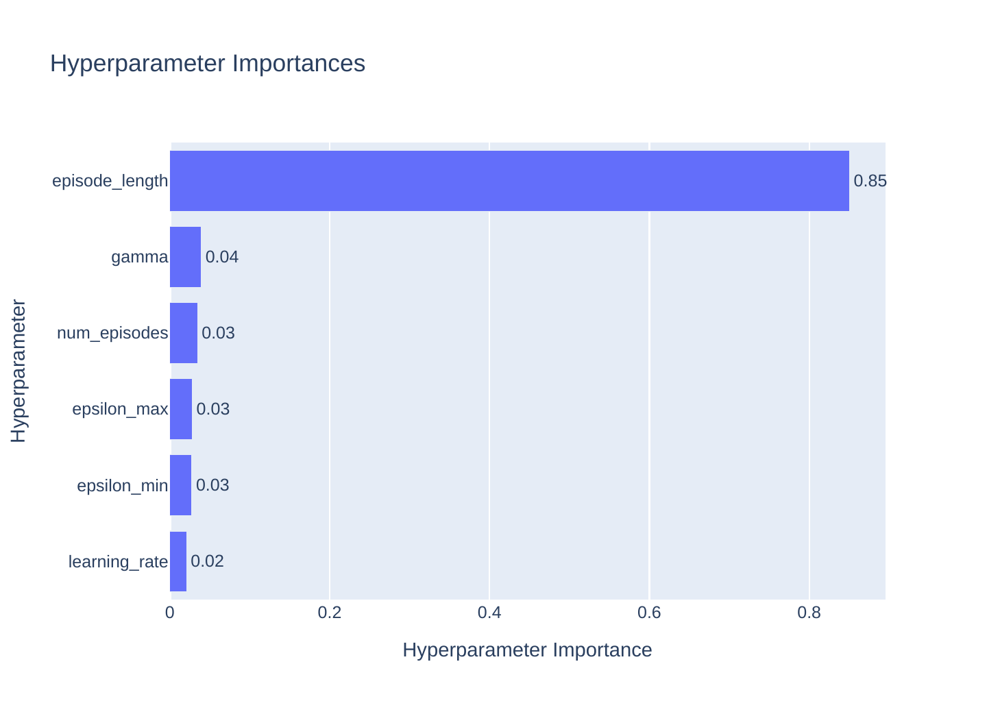
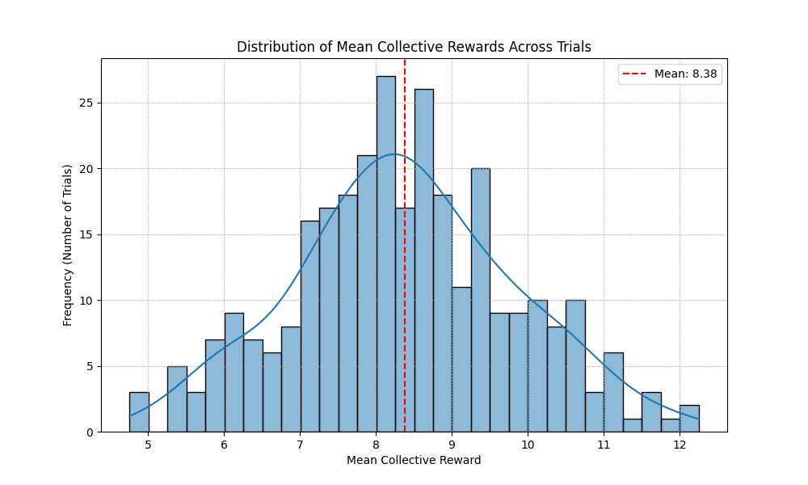

# 🤖 Multi-Agent Pathfinding & Game-Theoretic Joint Action Learning (POEGMA)

A multi-agent reinforcement learning and game theory framework evaluating **Joint Action Learning (JAL-GT)** across game-theoretic solution concepts (**Nash Equilibrium, Pareto Optimality, Minimax Safety, and Social Welfare Maximization**) in partially observable grid environments. Developed for the *Distributed Intelligent Systems (SID)* curriculum at **UPC-FIB** (*Awarded Highest Honors / Matrícula de Honor*).

---

## 📊 Bayesian Hyperparameter Optimization & Empirical Sweeps

  
  

  
  

---

## 🔬 Game-Theoretic Solution Concepts

The system implements four distinct game-theoretic equilibrium solution concepts:
1. **Nash Equilibrium**: Mutual best-response profile where no agent has an incentive to unilaterally deviate:
   $$\forall i, \quad u_i(a_i^*, \mathbf{a}_{-i}^*) \ge u_i(a_i, \mathbf{a}_{-i}^*)$$
2. **Pareto Optimality**: Joint action profile where no agent can increase utility without decreasing another agent's utility:
   $$\nexists \mathbf{a} \text{ s.t. } \forall i, u_i(\mathbf{a}) \ge u_i(\mathbf{a}^*) \wedge \exists j, u_j(\mathbf{a}) > u_j(\mathbf{a}^*)$$
3. **Minimax Safety**: Conservative risk-averse policy maximizing security values under adversarial assumptions:
   $$a_i^* = \arg\max_{a_i} \min_{\mathbf{a}_{-i}} u_i(a_i, \mathbf{a}_{-i})$$
4. **Social Welfare Maximization**: Cooperative optimization maximizing aggregate collective payoff:
   $$\mathbf{a}^* = \arg\max_{\mathbf{a}} \sum_{i=1}^N u_i(\mathbf{a})$$

---

## 👥 Authors & Collaborators

* **Marcel Alabart Benoit** ([@Androm3d](https://github.com/Androm3d))
* **Edgar** ([@Edexel2vic](https://github.com/Edexel2vic))
* **Pau** ([@pacopua](https://github.com/pacopua))

---

## 📂 Subproject Contents

* `src/`: Joint action learning core and solution concepts (`solution_concepts.py`, `trial.py`, `utils.py`).
* `figures/`: Empirical Optuna HPO sweeps, parameter importances, and convergence histories.
* `pogema_marl_hpo_v_simple.db`: Full SQLite database storing Bayesian HPO trials.
* `baseline.ipynb`: End-to-end evaluation notebook.
