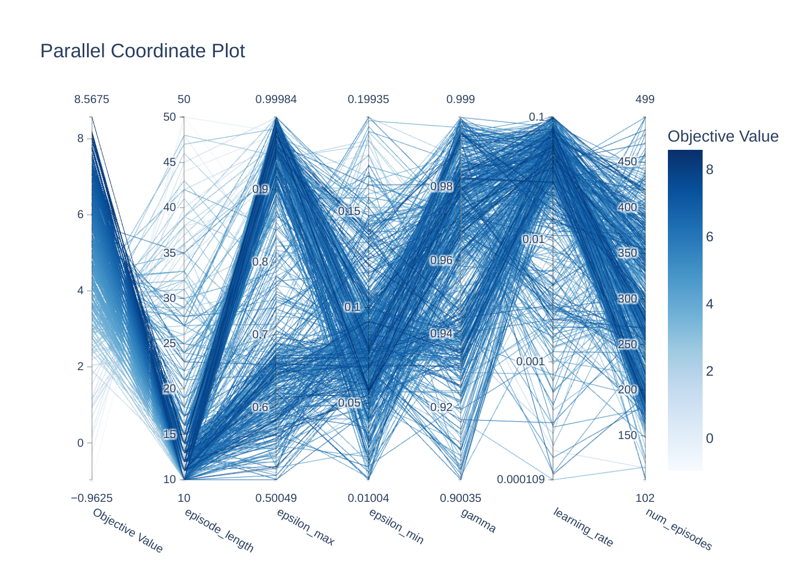
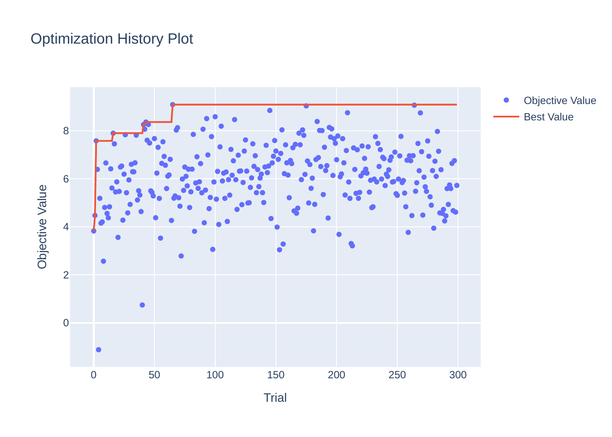

# 🤖 Multi-Agent Reinforcement Learning & Symbolic AI Suite

A comprehensive repository showcasing research and implementations in **Multi-Agent Reinforcement Learning (MARL), Game-Theoretic Equilibria, Belief-Desire-Intention (BDI) Systems, Automated Planning, and Heuristic Search**, developed across courses at **UPC-FIB** (*Distributed Intelligent Systems - SID [Matrícula de Honor]* and *Artificial Intelligence - IA*).

[](https://www.python.org/)
[](https://www.oracle.com/java/)
[](https://pytorch.org/)
[](https://www.fib.upc.edu/)

---

## 🏛️ Repository Architecture

```
marl-and-symbolic-ai/
├── POEGMA-SID/                   # Multi-Agent Pathfinding (MAPF) & Game-Theoretic JAL [MH]
│   ├── src/                      # Joint Action Learning (Nash, Pareto, Minimax, Welfare)
│   ├── figures/                  # Optuna hyperparameter optimization contours & Pareto fronts
│   └── pogema_marl_hpo_v_simple.db # SQLite database of Bayesian HPO trials
├── agentspeak_symbolic_ctf/      # BDI Capture-the-Flag tactical multi-agent architecture
│   ├── agents/                   # AgentSpeak (.asl) plans (Coordinator, Attacker, Defender, Scout)
│   └── run_simulation.py         # Multi-agent battle runner in PyGomas
├── rl_cliffwalking_qlearning/    # Temporal Difference RL benchmark (Q-Learning vs. SARSA)
│   ├── figures/                  # Continuous State-Value potential heatmaps & learning curves
│   └── qlearning.py              # TD(0) Off-policy Q-Learning, SARSA, and Value Iteration
├── pddl_automated_planning/      # PDDL 2.1 automated planning across 4 progressive extensions
│   ├── nivel_basico/             # STRIPS model & Java problem generator
│   ├── extension1/ - extension4/ # Fuel, temporal concurrency & metric optimization
│   └── Proyecto de Planificación.pdf # Research report
└── heuristic_search_azamon/      # Combinatorial package routing via Java AIMA local search
    ├── src/                      # AzaState, Heuristics (h1, h2), Move & Swap successors
    ├── lib/                      # AIMA.jar & Azamon.jar dependencies
    └── Local_Search.pdf          # Research report & benchmark analysis
```

---

## 📊 Visual Highlights & Analytics

### 1. Multi-Agent Game-Theoretic Hyperparameter Sweeps (`POEGMA-SID`)
<p align="center">
  
  
</p>

### 2. Reinforcement Learning: State-Value Heatmap & Convergence (`rl_cliffwalking`)
<p align="center">
  
  
</p>

---

## 🔬 Core Methodological Pillars

### 1. Game-Theoretic Multi-Agent Pathfinding (`POEGMA-SID`) — *Matrícula de Honor*
* **Joint Action Learners (JAL)**: Solves multi-agent coordination under partial observability across 4 game-theoretic solution concepts: **Nash Equilibrium, Pareto Optimality, Minimax Safety, and Social Welfare Maximization**.
* **Bayesian Hyperparameter Optimization (Optuna)**: Explores high-dimensional learning rates ($\alpha$), discount factors ($\gamma$), and exploration schedules ($\epsilon_{\text{max}} \to \epsilon_{\text{min}}$) to isolate optimal coordination regimes.

### 2. BDI Multi-Agent Coordination (`agentspeak_symbolic_ctf`)
* Modeled in **AgentSpeak(L)** for real-time tactical Capture-The-Flag simulations.
* Features specialized role allocation (Coordinator, Attacker, Defender, Scout) communicating via asynchronous message brokers.

### 3. Temporal Difference Learning (`rl_cliffwalking_qlearning`)
* Rigorously benchmarks Off-Policy Q-Learning against On-Policy SARSA on the CliffWalking gridworld.
* Highlights the empirical tension between optimal risky trajectories vs. safe risk-averse exploration.

### 4. Hierarchical Planning & Combinatorial Local Search (`pddl` & `azamon`)
* **PDDL 2.1**: Autonomous exploration planning across 4 progressive extensions (fuel consumption, temporal concurrency, and metric optimization).
* **Azamon AIMA Java**: Non-linear package-to-transport combinatorial optimization solved via Hill Climbing and Simulated Annealing with custom heuristics ($h_1, h_2$).

---

## 👥 Authors & Credits

* **Marcel Alabart Benoit** ([@Androm3d](https://github.com/Androm3d))
* **Víctor Ramírez Arimaha** ([@Edexel2vic](https://github.com/Edexel2vic)) — *Co-Author (SID & IA Projects)*
* **Adrià Cebrián Ruiz** ([@pacopua](https://github.com/pacopua)) — *Co-Author (SID & IA Projects)*
