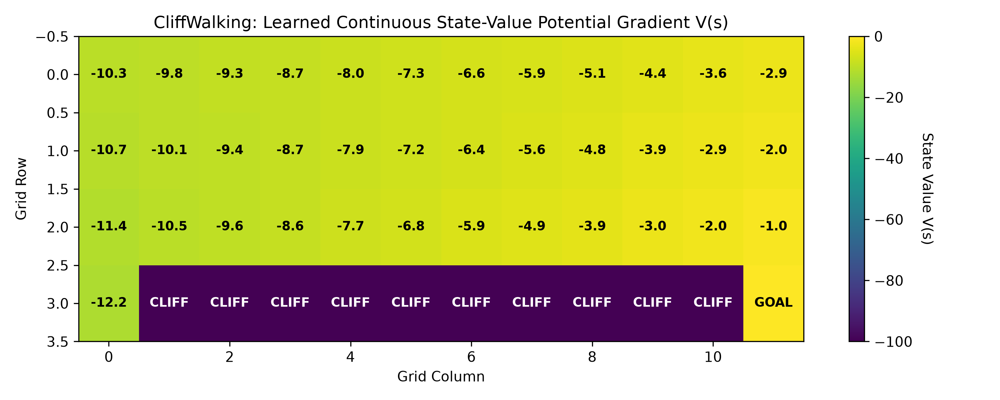
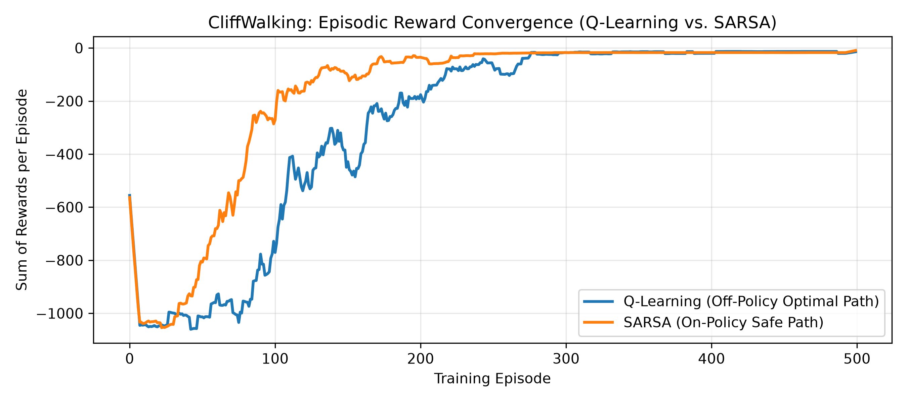

# 🧗 Temporal Difference RL: CliffWalking Benchmark (Q-Learning vs. SARSA)

A comprehensive reinforcement learning suite benchmarking **Temporal Difference (TD) learning algorithms** (Off-Policy Q-Learning, On-Policy SARSA, and Dynamic Programming Value Iteration) on the classic **CliffWalking** grid environment. Developed for the *Distributed Intelligent Systems (SID)* curriculum at **UPC-FIB**.

---

## 📊 Empirical Visualizations

  
  

---

## 🔬 Mathematical Formulations

### 1. Off-Policy Q-Learning (Bellman Optimality Backup)
Updates the action-value function $Q(s, a)$ greedily using the estimated maximum return over subsequent actions:
$$Q(s_t, a_t) \leftarrow Q(s_t, a_t) + \alpha \left[ r_{t+1} + \gamma \max_{a} Q(s_{t+1}, a) - Q(s_t, a_t) \right]$$

### 2. On-Policy SARSA (Expected Trajectory Backup)
Updates $Q(s, a)$ based on the actual action $a_{t+1}$ chosen under the behavioral exploration policy:
$$Q(s_t, a_t) \leftarrow Q(s_t, a_t) + \alpha \left[ r_{t+1} + \gamma Q(s_{t+1}, a_{t+1}) - Q(s_t, a_t) \right]$$

### 3. Dynamic Programming: Value Iteration
Iteratively computes state-value convergence $V(s)$ via the Bellman optimality operator until $\|V_{k+1} - V_k\|_\infty < \theta$:
$$V(s) \leftarrow \max_{a} \sum_{s', r} p(s', r \mid s, a) \left[ r + \gamma V(s') \right]$$

---

## 💡 The CliffWalking Paradox: Safe vs. Optimal Path
* **Q-Learning (Optimal Path)**: Learns the shortest trajectory along the cliff boundary ($R = -13$). However, during $\epsilon$-greedy exploration, random exploratory actions frequently trigger the $-100$ cliff penalty.
* **SARSA (Safe Path)**: Takes the risk-averse upper route ($R = -17$). Because it accounts for exploratory mistakes ($a_{t+1}$ sampled from $\pi_\epsilon$), it achieves superior average cumulative rewards during training.

---

## 📂 Source Code & Scripts

* `q_learning.py`: TD(0) Off-Policy Q-Learning implementation.
* `sarsa.py`: On-Policy SARSA implementation.
* `value_iteration.py`: Bellman dynamic programming backup.
* `cliff_environment.py`: Gym-style 4x12 gridworld environment.
* `generate_rl_plots.py`: Verification and high-resolution figure generator.
